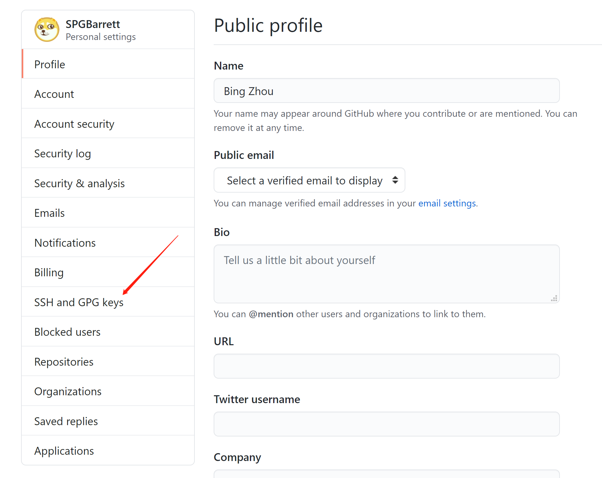
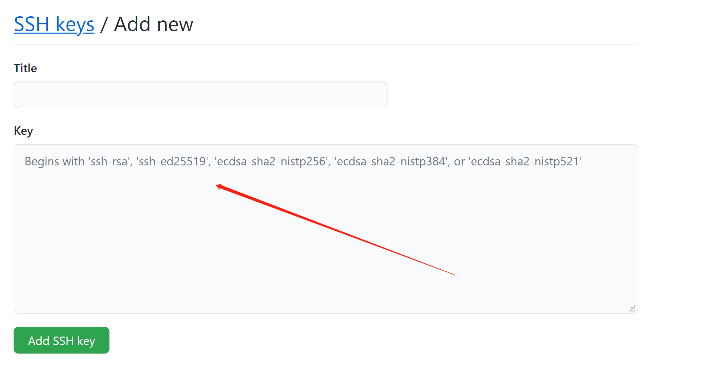

# Git快速上手及IDEA集成Git


[TOC]

## 集中与分布式，Git和SVN

 **集中版本控制：**所有版本的数据都保存在服务器上，协同开发者从服务器上同步更新或者上传自己的修改。


**分布式版本控制：**所有版本信息仓库全部同步到本地的每个用户，可以在本地查看所有版本，可以离线提交，只需要在联网的时候push到服务器即可。每个人都拥有所有代码，只要有一个人的设备没有问题就能恢复所有代码，但增加了本地储存空间。


**Git和SVN的主要区别：**

SVN是集中式版本管理控制系统，版本库是集中放在中央服务器的，而工作的时候使用的是自己的设备，所以首先要从中央服务器获得最新版本，然后工作，工作结束后，需要提交及推送。集中式版本管理必须要联网才能工作，对网络带宽要求高。

Git是分布式版本管理系统，没有中央服务器，每个人的电脑就是一个完整的版本库，工作时不需要联网。协同作业时，如果多个人修改了相同的文件，只需要将修改推送给对方，然后协商确定最终版本即可。**Git是目前市面上最先进的分布式版本控制系统。**


## Git简史

> 同生活中的许多伟大事物一样，Git 诞生于一个极富纷争大举创新的年代。
>
> Linux 内核开源项目有着为数众多的参与者。 绝大多数的 Linux 内核维护工作都花在了提交补丁和保存归档的繁琐事务上（1991－2002年间）。 到 2002 年，整个项目组开始启用一个专有的分布式版本控制系统 BitKeeper 来管理和维护代码。
>
> 到了 2005 年，开发 BitKeeper 的商业公司同 Linux 内核开源社区的合作关系结束，他们收回了 Linux 内核社区免费使用 BitKeeper 的权力。 这就迫使 Linux 开源社区（特别是 Linux 的缔造者 Linus Torvalds）基于使用 BitKeeper 时的经验教训，开发出自己的版本系统。 他们对新的系统制订了若干目标：
>
> - 速度
> - 简单的设计
> - 对非线性开发模式的强力支持（允许成千上万个并行开发的分支）
> - 完全分布式
> - 有能力高效管理类似 Linux 内核一样的超大规模项目（速度和数据量）
>
> 自诞生于 2005 年以来，Git 日臻成熟完善，在高度易用的同时，仍然保留着初期设定的目标。 它的速度飞快，极其适合管理大项目，有着令人难以置信的非线性分支管理系统

Reference: https://git-scm.com/book/zh/v2/%E8%B5%B7%E6%AD%A5-Git-%E7%AE%80%E5%8F%B2

很多人都知道，Linus在1991年创建了开源的Linux，从此，Linux系统不断发展，已经成为最大的服务器系统软件了。Linus虽然创建了Linux，但Linux的壮大是靠全世界热心的志愿者参与的，这么多人在世界各地为Linux编写代码，那Linux的代码是如何管理的呢？事实是，在2002年以前，世界各地的志愿者把源代码文件通过diff的方式发给Linus，然后由Linus本人通过手工方式合并代码！

你也许会想，为什么Linus不把Linux代码放到版本控制系统里呢？不是有CVS、SVN这些免费的版本控制系统吗？因为Linus坚定地反对CVS和SVN，这些集中式的版本控制系统不但速度慢，而且必须联网才能使用。有一些商用的版本控制系统，虽然比CVS、SVN好用，但那是付费的，和Linux的开源精神不符。

不过，到了2002年，Linux系统已经发展了十年了，代码库之大让Linus很难继续通过手工方式管理了，社区的弟兄们也对这种方式表达了强烈不满，于是Linus选择了一个商业的版本控制系统BitKeeper，BitKeeper的东家BitMover公司出于人道主义精神，授权Linux社区免费使用这个版本控制系统。

安定团结的大好局面在2005年就被打破了，原因是Linux社区牛人聚集，不免沾染了一些梁山好汉的江湖习气。开发Samba的Andrew试图破解BitKeeper的协议（这么干的其实也不只他一个），被BitMover公司发现了（监控工作做得不错！），于是BitMover公司怒了，要收回Linux社区的免费使用权。

Linus可以向BitMover公司道个歉，保证以后严格管教弟兄们，嗯，这是不可能的。实际情况是这样的：

Linus花了两周时间自己用C写了一个分布式版本控制系统，这就是Git！一个月之内，Linux系统的源码已经由Git管理了！牛是怎么定义的呢？大家可以体会一下。

Git迅速成为最流行的分布式版本控制系统，尤其是2008年，GitHub网站上线了，它为开源项目免费提供Git存储，无数开源项目开始迁移至GitHub，包括jQuery，PHP，Ruby等等。

历史就是这么偶然，如果不是当年BitMover公司威胁Linux社区，可能现在我们就没有免费而超级好用的Git了。


## Git流程图

Git本地有三个工作区：工作目录（Working Directory），暂存区（Stage/Index），资源库（Repository）。远程有一个工作区：远程仓库（Remote Directory）。本地的三个工作区的关系图如下：


本地的这些，其实是以文件的形式保存在工程所在目录下的.git文件夹中。

**Git的工作流：**

（1）在工作目录中添加及修改文件

（2）将要进行版本管理的文件放入暂存区域

（3）将暂存区域的文件提交到Git仓库

由此，Git管理的文件有三种状态：modified已修改；staged已暂存；committed已提交


## Git实战操作

通过上一章节了解了Git的基本原理及流程，下面就是具体的操作了。

**Step1: Git安装及初始配置**

安装直接去官网：https://git-scm.com/

根据自己的系统版本下载，根据实际需求，“下一步”无脑安装即可。

安装好之后，需要设置用户名和邮箱（必须），否则无法提交代码，设置方法如下：

**（1）**安装好Git后，程序列表中和鼠标右键菜单中都会出现Git的程序。有Git Bash（Linux命令行风格）或者Git CMD（Windows命令行风格），还有Git GUI（图形化界面的程序，不推荐，因为没啥卵用，命令行才是王道）。

首先使用如下命令之一：

```bash
# 显示当前项目下的所有Git配置：
git config -l
# 查看所有全局用户配置：
git config --global --list
```

**（2）**查看是否有如下的显示，如果没有，则需要配置

```bash
user.name=SPGBar***
user.email=spg_bar***@live.cn
```

配置的命令如下：

```bash
git config --global user.name xxsxxxx
git config --global user.email xxxxxx@xxx.com
```

完成以上配置，就能开始使用git了。

**Note：**所有的配置文件都保存在本地，设置配置的本质，其实是写文件。

配置文件的位置：

* Git安装目录下的gitconfig文件：system系统级
* C盘user目录中个人账户目录下的.gitconfig文件：global全局

Git也不需要单独的去配置环境变量，因为在可视化安装的过程中，程序就自动配置好了。（配置环境变量的目的，就是为了cmd能在任意目录下使用相应命令）。**同样的，也是因为这个原因，使用git也可以直接使用系统的cmd来操作，不一定非要用Git Bash或者Git Cmd。**


**Step2: Git初始化项目**

Git初始化项目有两种方式：

**（1）**直接初始化的方式：

定位到需要初始化git项目的目录，打开Git Bash，并使用指令：

```bash
git init
```

这样就能初始化项目了，其本质就是在该项目路径下，创建了.git文件夹以及其内部的一些文件。所以，如果想重来，直接删掉.git文件夹，再来一次就行。

**（2）**从远程目录克隆的方式：

在Github或者Gitee的仓库找到仓库的url，然后在本地新建一个目录或者使用已有的目录，在目录路径下打开Git Bash，并使用指令：

```bash
git clone 仓库的url地址
```

例如：

```bash
git clone https://github.com/SPGBarrett/smartsite-master.git
```


**Step3: 添加Git文件到跟踪状态**

在工作目录下，使用指令：

```bash
# 添加所有文件到跟踪状态
git add .
```

可以通过如下指令查看文件的跟踪状态（颜色也不同）：

```bash
# 查看文件当前状态
git status
```


**Step4: 提交到本地仓库**

使用如下指令提交到本地仓库：

```bash
git commit -m 这里写本次提交的信息说明
```

例如：

```bash
git commit -m 修改了bug
```


**Step5：忽略文件.gitignore**

并不是所有的文件都需要提交到远程仓库，例如前端代码里的node_module文件夹里的文件，后端项目的jar包，idea配置文件以及一些临时文件等等。忽略这些文件的功能是通过配置.gitignore文件来实现的。

在工作目录下新建.gitignore文件，文件中的配置规则如下：

* 文件中的空行和以井号（#）开始的行将会被忽略，也就是（#）用于注释
* 可以使用Linux通配符。例如（*）代表任意多个字符，（?）代表一个字符，（[]）代表可选字符范围，（{}）代表可选的字符串
* 如果名称最前面有感叹号（!），表示例外规则，将不被忽略。
* 如果名称的最前面是一个路径分隔符，表示要忽略的文件在此目录下，而子目录的文件不忽略
* 如果名称的最后面是一个路径分隔符，表示要忽略的是此目录下文件和目录都忽略

例如：

```bash
# 注释
*.txt        # 忽略所有.txt结尾的文件
!lib.txt     # 不忽略lib.txt文件
/temp        # 忽略temp目录下的文件，但其子目录不忽略
build/       # 忽略build目录下的所有文件
doc/*.txt    # 忽略doc目录下的所有.txt文件，但子目录中的不忽略
```

这里给出一个基于IDEA的.gitignore文件模板：（其实使用IDEA的Spring Initializer新建Springboot项目时，会自动生成一个这个文件）

```bash
# Created by Barrett Zhou
### JetBrains Templates
# Covers JetBrains IDEs: IntelliJ, RubyMine, PhpStorm, AppCode, PyCharm, CLion, Android Studio
###### Personal Specific Ignores：######
#class file
*.class

#package file
*.jar
*.war
*.ear

#maven ignore
taget/

#kdiff3 ingnore
*.orig

#eclipse ignore
.settings/
.project
.classpath

#idea
.idea/
/idea/
*.ipr
*.iml
*.iws

# temp file
*.log
*.lock
*.cache
*.diff
*.tmp

#system
.DS_Store
Thumbs.db


# if you remove the above rule, at least ignore the following:
 
# User-specific stuff:
# .idea/workspace.xml
# .idea/tasks.xml
# .idea/dictionaries
 
# Sensitive or high-churn files:
# .idea/dataSources.ids
# .idea/dataSources.xml
# .idea/sqlDataSources.xml
# .idea/dynamic.xml
# .idea/uiDesigner.xml
 
# Gradle:
# .idea/gradle.xml
# .idea/libraries
#*.log
 
# Mongo Explorer plugin:
# .idea/mongoSettings.xml
 
## File-based project format:
#*.ipr
#*.iws
 
## Plugin-specific files:
 
# IntelliJ
#/out/
 
# mpeltonen/sbt-idea plugin
#.idea_modules/
 
# JIRA plugin
#atlassian-ide-plugin.xml
 
# Crashlytics plugin (for Android Studio and IntelliJ)
#com_crashlytics_export_strings.xml
#crashlytics.properties
#crashlytics-build.properties
### Maven template
#target/
#pom.xml.tag
#pom.xml.releaseBackup
#pom.xml.versionsBackup
#pom.xml.next
#release.properties
#dependency-reduced-pom.xml
#buildNumber.properties
#.mvn/timing.properties
```

**Step6：配置远程仓库**

配置远程仓库是为了明确本地仓库的推送目的地。如果是使用git clone的方式建立的本地仓库并且不修改对应的远程仓库的话，可以跳过这一步，因为git clone本身就是从远程仓库拉取的，自然默认的就指向了那个仓库。

使用如下指令配置远程仓库：

```bash
# 将本地仓库与远程仓库关联（这里的origin只是个名字标记，也可用别的名字）
# 第一次push之前，设置一次就行
git remote add origin 仓库链接的url

# 如果要修改远程仓库的关联，则需要先删除关联，再添加新的，删除指令为
git remote rm origin
```


**Step7: 推送到远程仓库**

如果直接是clone的项目，直接push就行了

如果是init的项目，首先需要设置origin，然后拉取，然后在push

一会儿具体说明和测试


**附加：推送到多个仓库的配置方案**


前几天有次从github把项目 `pull`到本地时速度特别慢，想着应该是github服务器在国外的原因，于是就想把自己的项目在推送到github上时同步推送到国内的某个代码托管平台，经过一番比较之后我选择了码云。
 那么如何方便快捷的把代码托管到多个平台呢？
 例如我有下面两个仓库：
 `https://gitee.com/jiaiqi/test.git`
 `https://github.com/jiaiqi/test.git`

## 第一种方式

在本地项目文件夹执行  `git init`之后
 先添加第一个仓库
 `git remote add origin https://gitee.com/jiaiqi/test.git`
 再添加第二个仓库：
 `git remote set-url --add origin https://github.com/jiaiqi/test.git`
 如果还有其他，则可以像添加第二个一样继续添加其他仓库。
 然后使用下面命令提交：
 `git push origin --all`
 打开.git/config，可以看到这样的配置：

> [remote "origin"]
>  url = https://gitee.com/jiaiqi/test.git
>  fetch = +refs/heads/*:refs/remotes/origin/*
>  url = https://github.com/jiaiqi/test.git

刚才的命令其实就是添加了这些配置。如果不想用命令行，可以直接编辑该文件，添加对应的url即可。

## 第二种方式

在本地项目文件夹执行  `git init`之后
 先添加第一个仓库
 `git remote add gitee https://gitee.com/jiaiqi/test.git`
 再添加第二个仓库：
 `git remote add github https://github.com/jiaiqi/test.git`
 在这里为了方便区分，我把github仓库地址代号(上面代码add后面的单词)命名为`github`，码云仓库地址代号命名为`gitee`
 在git bash中输入`git remote -v`可以查看本地仓库现在连接了那个远程仓库。
 使用`git push 仓库代号 分支`提交代码到远程仓库
 刚才我链接的两个远程仓库，推得时候就要这样写了：
 `git push github master`
 `git push gitee master`

打开.git/config,此时配置文件如下所示


小结：

实战中，只需要记住常用的几个命令：


更多指令参考官方文档：https://git-scm.com/docs/git


除非是需要修改，step1和step5，只需要在首次使用的时候配置好即可。


## IDEA集成Git

**Step1：**将IDEA项目与Git绑定起来

**方式1：**使用git clone + 文件拷贝（万能方式）

（1）首先在github或者gitee上新建一个空的仓库

（2）在本地找到一个路径或者新建一个文件夹，使用```git clone url``` 命令将刚建好的空仓库拉取到本地

（3）将拉取到的所有文件，直接拷贝到需要绑定的IDEA项目目录中

（4）此时，IDEA中会有弹框提示，根据提示，点击确定即可。

**方式2：**使用git init

定位到项目路径，运行Git Bash，并依次输入如下指令

```bash
# 初始化git项目
git init

# 添加目录下所有文件到stage
git add .

# 提交到本地仓库并添加提交说明
git commit -m "说明xxx"

# 将本地仓库与远程仓库关联（这里的origin只是个名字标记，也可用别的名字）
# 第一次push之前，设置一次就行
git remote add origin 仓库链接的url

# 如果要修改远程仓库的关联，则需要先删除关联，再添加新的，删除指令为
git remote rm origin
```

以上指令执行完之后，IDEA中也会出现弹框提示，点击“确认”即可。

**Step2：**可以使用IDEA自带的version control控件傻瓜式操作，也可以在IDEA命令行中，使用git命令进行操作。操作方式与上一章节中讲到的一样。操作的流程也和上一章节中讲的一样。也基本就是add->commit->pull->push这样，例如：

```bash
# 添加目录下所有文件到stage
git add .

# 提交到本地仓库并添加提交说明
git commit -m "说明xxx"

# 推送到远程仓库前，先拉取(以master分支为例)
git pull origin master

# 将本地仓库推送到远程仓库(以master分支为例)
git push -u origin master
```


## Git多分支

分支相关的指令：

```bash
# 列出所有本地分支
git branch

# 列出所有远程分支
git branch -r

# 新建一个分支，但依然停留在当前分支
git branch 分支名称

# 新建一个分支，并切换到该分支
git checkout -b 分支名称

# 合并指定分支到当前分支
git merge 分支名称

# 删除分支
git branch -d 分支名称

# 删除远程分支
git push origin --delete 分支名称
git branch -dr remote/分支名称
```

引起冲突的解决方法是修改冲突后再提交

**master主分支应该非常稳定，用来发布新版本，一般情况下不允许在上面工作，工作一般在新建的dev上，如果要发布或者dev分支的代码稳定后，再合并到master分支。**


## SSH公钥配置

配置SSH Key的目的，是为了省去每次push都需要输入账号和密码的繁琐操作

**配置方法：**

**（1）查看是否已经有ssh key了**

* 打开Git Bash
* 输入`ls -al ~/.ssh`，看SSH Keys是否存在
* 如果存在，则会列出如下文件：
  - *id_rsa.pub*

**（2）生成SSH Key （如果上一步查找到已经有了，则可跳过此步骤）**

* 打卡Git Bash

* 输入如下指令

  ```shell
  $ ssh-keygen -t rsa -b 4096 -C "your_email@example.com"
  ```

* 提示"Enter a file in which to save the key," 直接点击回车，将文件创建在默认的路径下`/c/Users/you/.ssh/id_rsa`
* 然后提示“type a secure passphrase”，这里输入一个类似密码的东西，密码自己定。他的意思是为尼的SSH Key多加一层保护机制，否则，如果别人轻易获取到你的SSH，就能轻松进入你所有和SSH绑定的账号了。
* 完成上述步骤就生成好了SSH Key了。

**（3）进入SSH的目录`/c/Users/you/.ssh/id_rsa`，使用notepad++或类似软件打开`id_ras.pub`文件。里面保存的就是SSH公钥了。**

**（4）进入Github你的账户的Setting中，并进入SSH Key的设置页面**



进入后，点击“new ssh key” ，然后将id_rsa.pub文件中的内容拷贝进去，点击“add ssh key"就完成了。



参考Github生成SSH秘钥的说明文档：https://docs.github.com/en/github/authenticating-to-github/connecting-to-github-with-ssh


