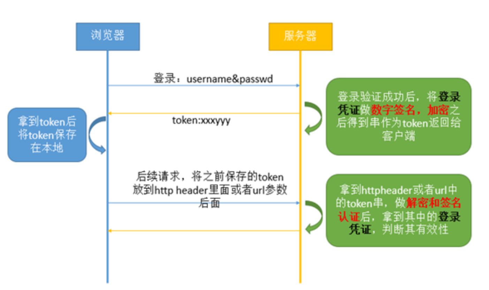

# 实战-SPA项目实现认证及鉴权

[TOC]

## 1. 序言

本文讲解前后端分离项目实现用户认证和鉴权的功能。内容主要包括：

1. 常用的认证及鉴权方式和一些基础知识 
2. 认证和鉴权的流程
3. 常用的认证和鉴权框架
4. 基于SpringSecurity和JWT的认证鉴权后端保姆级实现
5. OAuth2.0实现

## 2. 常见几种认证及鉴权方式及流程

1.单体应用下的常用方案

传统的单体应用，一般会写一个固定的认证和鉴权的包，里面包含很多的认证和鉴权的类，当用户请求时可以利用session的方式，把用户存入session并生成一个sessionid，之后返回客户端。客户端可以存在cookie里，从而在后续的请求中顺利通过验证。

常用框架：shiro 、自定义注解、Filter拦截等

2.微服务下的SSO单点登陆方案

单点登录(Single Sign On),简称为 SSO,是目前比较流行的企业业务  整合的解决方案之一。SSO的定义是在多个应用系统中,用户只需要登录一次就可以访问所有相互信任的应用系统，如CAS（Central  Authentication Service），是耶鲁大学开发的单点登录系统（SSO，single  sign-on），应用广泛，具有独立于平台的，易于理解，支持代理功能。

但是针对微服务(服务之间调用)：每个 服务都进行每个用户端  的sso动作，那么每个服务里都会做用户的认证和鉴权，可能保存每个用户的信息或者每个用户都会和鉴权服务打交道，这些情况都会带来非常大的网路开销和性能消耗，也有可能会造成数据的不一致，所以不建议用这种方案。

3.分布式Session与网关结合方案

1)用户在网关进行sso登陆 ，进行用户认证，检查用户是否存在和有效

2）如何用户通过，则将用户信息存储在第三方中间件中，如mysql、redis

3)后端可以从共享存储拿到用户的数据

很多 场景下，这种方案是推荐的，因为方便扩展，也 可以保证高可用的方案。但是这种方案的缺点是依赖于第三方中间件，且这些部件需要 做高可用，并且增加安全的控制，所有对于实现有一定的复杂度

4.客户端Token与 网关结合方案

实现步骤

1）客户端持有一个token，通常可用jwt或者其它加密的算法实现自己的一种Token，然后通过token保存用户的信息

2）发起用户请求并携带token，token传到网关层后，网关 层进行认证和校验。

3）校验通过，携带token到后端服务中

4）如果涉及到用户的大量信息存放，token就有可能不太合适（或者用中间件来存放）

这种方案也是业界很常用的方案，但是对于 token来说，他的注销有一定的麻烦，需要在网关层进行Token的注销

5.浏览器Cookie与网关结合方案

这种方式和上面的方式类似，但不同的是我们把用户的信息存放在cookie里，然后通过网关来解析cookie，从而  获取用户的相关信息，这种方式在一些老系统做改造时遇到的比较多，适合做为老系统改造时采取的方案，因为很多系统需要继承，这时cookie在别的系统中也是同样的适用。

6.网关Token和 服务间鉴权结合

我们都知道网关适合做认证和鉴权，但是在安全层面，我们要求更严格的权限，对于有些项目来说，本身网络跟外部隔离，再加上其它的安全手段，所以我们只要求在网关上鉴权就可以了。

但是有些时候服务对 服务之间的调用进行鉴权，知道某个用户是否有权限调用某个接口，这些都需要进行鉴权。

这时的方案如下。

1）在gateway网关层做认证，通过用户校验后，传递用户信息到header中，后台做服务在收到header后进行解析，解析完后查看是否有调用此服务或者某个url的权限，然后完成鉴权

2）从服务内部发出的请求，在出去时进行拦截，把用户信息保存在header里，然后传出去,被调用方取到header后进行解析和鉴权

基于Session：

服务端session是用户第一次访问应用时，服务器就会创建的对象，代表用户的一次会话过程，可以用来存放数据。服务器为每一个session都分配一个唯一的sessionid，以保证每个用户都有一个不同的session对象。

服务器在创建完session后，会把sessionid通过cookie返回给用户所在的浏览器，这样当用户第二次及以后向服务器发送请求的时候，就会通过cookie把sessionid传回给服务器，以便服务器能够根据sessionid找到与该用户对应的session对象。

session通常有失效时间的设定，比如2个小时。当失效时间到，服务器会销毁之前的session，并创建新的session返回给用户。但是只要用户在失效时间内，有发送新的请求给服务器，通常服务器都会把他对应的session的失效时间根据当前的请求时间再延长2个小时。

session在一开始并不具备会话管理的作用。它只有在用户登录认证成功之后，并且往sesssion对象里面放入了用户登录成功的凭证，才能用来管理会话。管理会话的逻辑也很简单，只要拿到用户的session对象，看它里面有没有登录成功的凭证，就能判断这个用户是否已经登录。当用户主动退出的时候，会把它的session对象里的登录凭证清掉。所以在用户登录前或退出后或者session对象失效时，肯定都是拿不到需要的登录凭证的。

基于Token：

1. 用户在浏览器中输入用户和密码，后台服务器通过加密或者其他逻辑，生成一个Token。
2. 前端获取到Token，存储到cookie或者localStorage中，在接下来的请求中，将token通过url参数或者HTTP Header头部传入到服务器
3. 服务器获取token值，通过查找数据库判断当前token是否有效

基于Token登录，而且可以用于第三方单点登录的OAuth2.0更适合。可以参考网址：[理解OAuth 2.0](http://www.ruanyifeng.com/blog/2014/05/oauth_2_0.html)

SpringSecurity框架默认基于thymeleaf等模板框架，通过简单的配置就能实现认证和鉴权的基本功能。但是这些默认的配置对于SPA的模式就不再适用。所以在使用SpringSecurity配置时，不能使用默认返回模板页面的配置，而需要配置成返回json格式的数据，然后前端页面在接收到json数据后，根据json数据内的内容进行进一步处理。就比如验证成功，就返回response200并包含用户信息，如果验证失败，就返回response4xx。这些json的构建需要自己完成。

### JWT的几个特点

- （1）JWT 默认是不加密，但也是可以加密的。生成原始 Token 以后，可以用密钥再加密一次。
- （2）JWT 不加密的情况下，不能将秘密数据写入 JWT。
- （3）JWT 不仅可以用于认证，也可以用于交换信息。有效使用 JWT，可以降低服务器查询数据库的次数。
- （4）JWT 的最大缺点是，由于服务器不保存 session 状态，因此无法在使用过程中废止某个 token，或者更改 token 的权限。也就是说，一旦 JWT 签发了，在到期之前就会始终有效，除非服务器部署额外的逻辑。
- （5）JWT 本身包含了认证信息，一旦泄露，任何人都可以获得该令牌的所有权限。为了减少盗用，JWT 的有效期应该设置得比较短。对于一些比较重要的权限，使用时应该再次对用户进行认证。
- （6）为了减少盗用，JWT 不应该使用 HTTP 协议明码传输，要使用 HTTPS 协议传输。

### 一）备选方案

上文基于『统一身份治理』的理念，提出了统一身份管理系统（UIMS）下关于身份认证和授权部分的主要需求。目前实现统一身份认证和授权的技术手段较多，总体可以归纳为以下两类：

1. 传统的 Cookie + Session 解决方案，有状态会话模式；
2. 基于令牌/票据的解决方案，无状态交互模式。

具体有：

- 分布式 Session
- OAuth2.0
- JWT
- CAS

上述方案各有利弊：

- 分布式 Session 是老牌的成熟解决方案，但因其状态化通信的特性与微服务提倡的API导向无状态通信相互违背，且共享式存储存在安全隐患，因此微服务一般不太采用。
- OAuth2.0 是业内成熟的授权登录解决方案，然而 OA2.0 提供了4种授权模式，能够适应多种场景，作为基于令牌的安全系统，可以广泛用于需要统一身份认证和授权的场景。

> 关于 OAuth2.0 的介绍，请参考 http://www.ruanyifeng.com/blog/2014/05/oauth_2_0.html

- JWT（JSON Web Token）是一种简洁的自包含的 JSON  声明规范，因其分散存储的特点而归属于客户端授权模式，广泛用于短期授权和单点登录。由于 JWT  信息是经过签名的，可以确保发送方的真实性，确保信息未经篡改和伪造。但由于其自包含的客户端验签特性，令牌一经签发，即无法撤销，因此单纯采用 JWT 作为统一身份认证和授权方案无法满足帐号统一登出和销毁、帐号封禁和解除这几种类型的需求。

> 关于 JWT 的介绍，请参考 http://blog.leapoahead.com/2015/09/06/understanding-jwt/

- CAS 是时下最成熟的开源单点登录方案，包含 CAS Server 和 CAS Client 两部分。CAS Server  是一个 war 包需要独立部署，负责用户认证；CAS Client 负责处理对客户端受保护资源的访问请求，需要认证时，重定向到 CAS  Server。值得注意的是，CAS 是一个认证框架，其本身定义了一套灵活完整的认证流程，但其兼容主流的认证和授权协议如  OAuth2、SAML、OpenID 等，因此一般采用 CAS + OAuth2 的方案实现 SSO 和授权登录。

> 关于 CAS 的介绍，请参考 https://apereo.github.io/cas/

在微服务架构下，身份认证和用户授权通常分离出来成为独立的鉴权服务。在做技术选型时，应从以下几点考虑：

1. 满足 SSO 的技术需求；
2. 满足简便性和安全性的需求；
3. 满足开放性和扩展性的需求。

