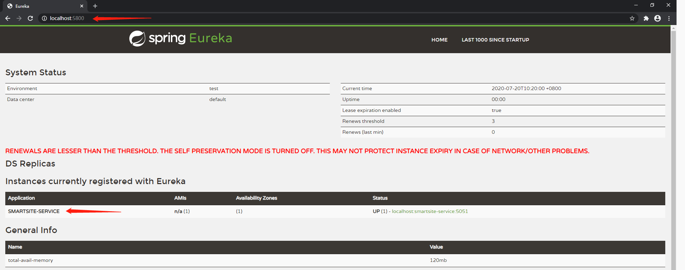

# 实战-SpringCloud之Eureka注册中心组件

[TOC]

## Preface

Eureka是Spring Cloud Netflix中用于实现注册中心功能的组件。能够实现类似功能的还有：Consul、Zookeeper、Nacos等组件。本文主要对Eureka注册中心的搭建及服务下线的通知做详尽说明。


## 注册中心代码实现

### 第一步：新建项目或Module

使用IDEA的Spring Initializer新建一个Module。


### 第二步：引入依赖

在提供注册中心服务的Module中的pom.xml文件中添加Eureka组件需要的依赖：

```xml
		<dependency>
            <groupId>org.springframework.boot</groupId>
            <artifactId>spring-boot-starter-actuator</artifactId>
        </dependency>	
		<dependency>
            <groupId>org.springframework.cloud</groupId>
            <artifactId>spring-cloud-starter-netflix-eureka-server</artifactId>
        </dependency>
```

### 第三步：开启注册中心功能

在注册中心Module的启动类中，加入@EnableEurekaServer的标签：

```java
import org.springframework.boot.SpringApplication;
import org.springframework.boot.autoconfigure.SpringBootApplication;
import org.springframework.cloud.netflix.eureka.server.EnableEurekaServer;

@SpringBootApplication
@EnableEurekaServer
public class EurekaServiceApplication {

    public static void main(String[] args) {
        SpringApplication.run(EurekaServiceApplication.class, args);
    }

}
```


### 第四步： 参数配置

在application.properties文件中添加参数配置，基本的参数配置及说明如下：

```properties
spring.application.name=eureka-service
server.port=5800
spring.profiles.active=dev
eureka.server.wait-time-in-ms-when-sync-empty=5
# Register Eureka itself:
#eureka.client.register-with-eureka=false
# Client fetch:
#eureka.client.fetch-registry=false
# Default url access: (Be aware!!! should be "defaultZone", not "default-zone", in both eureka server and client settings)
eureka.client.service-url.defualtZone=http://${eureka.instance.hostname}:${server.port}/eureka/
logging.level.com.netflix.eureka=OFF
logging.level.com.netflix.discovery=OFF

#一旦进入保护模式，Eureka Server将会尝试保护其服务注册表中的信息，不再删除服务注册表中的数据
eureka.server.enable-self-preservation=false
#每间隔3秒扫描一次注册的服务，将在客户指定的eureka.instance.leaseExpirationDurationInSeconds时间内没有发送心跳的服务下线
eureka.server.eviction-interval-timer-in-ms=5000
#是否允许将自己注册为服务
eureka.client.registerWithEureka=false
eureka.client.fetch-registry=false

```

通过上述简单的几步，就能实现基本的注册中心功能了。根据自己设置好的端口（实例中为5800），通过http://localhost:5800/ 就能访问到Eureka的页面。


## 需要在注册中心注册的模块代码实现

各个功能模组如果需要在Eureka注册中心注册，需要添加一些简单的代码。

### 第一步：新建项目或Module

使用IDEA的Spring Initializer新建一个Module，如果是已经有的Module，则跳过这一步。

### 第二步：引入依赖

在需要在注册中心注册的Module的pom.xml文件中，添加依赖：

```xml
		<dependency>
            <groupId>org.springframework.boot</groupId>
            <artifactId>spring-boot-starter-actuator</artifactId>
        </dependency>
        <dependency>
            <groupId>org.springframework.cloud</groupId>
            <artifactId>spring-cloud-starter-netflix-eureka-client</artifactId>
            <version>2.2.2.RELEASE</version>
        </dependency>
```

### 第三步：开启注册中心功能

在注册中心Module的启动类中，加入@EnableDiscoveryClient的标签：

```java
import org.springframework.boot.SpringApplication;
import org.springframework.boot.autoconfigure.SpringBootApplication;
import org.springframework.boot.web.servlet.FilterRegistrationBean;
import org.springframework.cloud.client.discovery.EnableDiscoveryClient;

@SpringBootApplication
@EnableDiscoveryClient
public class SmartsiteApplication {
    public static void main(String[] args) { SpringApplication.run(SmartsiteApplication.class, args); }
}
```


### 第四步： 参数配置

在application.properties文件中添加参数配置，基本的参数配置及说明如下：

```properties
spring.application.name=smartsite-service
spring.profiles.active=dev
##Server Port :
server.port=5051

# The default URL that can access Eureka dashboard:
eureka.client.register-with-eureka=true
# Client fetch:
eureka.client.fetch-registry=true
# 每间隔5s，向服务端发送一次心跳，证明自己依然存活
eureka.instance.lease-renewal-interval-in-seconds=5
# 告诉服务端，如果我10s之内没有给你发心跳，将我踢出掉
eureka.instance.lease-expiration-duration-in-seconds=10
# Eureka Server运行的地址
eureka.client.service-url.defaultZone=http://localhost:5800/eureka/

```

通过上述几步就能将该module运行的实例添加到注册中心了，在注册中心页面中可以查看到该实例，如图：




## Eureka服务下线邮件通知

### 第一步：添加依赖

在pom.xml文件中添加如下依赖，提供邮件发送的功能：

```xml
<!-- SpringBoot 发送邮件 -->
        <dependency>
            <groupId>org.springframework.boot</groupId>
            <artifactId>spring-boot-starter-mail</artifactId>
            <version>2.2.6.RELEASE</version>
        </dependency>
```

### 第二步：添加参数配置

在.properties文件中添加以下参数配置：

```properties
#协议
spring.mail.protocol=smtp
#字符集
spring.mail.default-encoding=UTF-8
#电子邮件地址
spring.mail.host=smtp.163.com
#邮箱账号名
spring.mail.username=xxxxx.163.com
#邮箱开启服务时提供的授权密码
spring.mail.password=xxxxxx
#NVSYAHGMTLJTHZCN
#邮箱服务器默认端口
spring.mail.port=25
```

这些均是发送邮件需要配置的一些参数，这里是以163邮箱为例，如果需要使用其他邮箱，做相应的修改即可。需要注意，邮箱需要开启SMTP服务才可以。


### 第三步： 下线事件监听

新建一个类，用于实现事件监听功能。这里将其命名为EurekaEventListenerService，代码如下：

```java
package com.barrett.eurekaservice.service;

import org.slf4j.Logger;
import org.slf4j.LoggerFactory;
import org.springframework.beans.factory.annotation.Autowired;
import org.springframework.cloud.netflix.eureka.server.event.*;
import org.springframework.context.event.EventListener;
import org.springframework.mail.SimpleMailMessage;
import org.springframework.mail.javamail.JavaMailSender;
import org.springframework.stereotype.Component;

import java.text.SimpleDateFormat;

/**
 * @program: smartsite-master
 * @description: Implement all Eureka related events
 * @author: Barrett
 * @create: 2020-07-13 19:06
 **/
@Component
public class EurekaEventListenerService {
    // Define logger:
    private final static Logger logger = LoggerFactory.getLogger(EurekaEventListenerService.class);
    @Autowired
    private JavaMailSender jms;

    // **********Define and implement event listeners: ******************
    // Service cancelled event:
    @EventListener(condition = "#event.replication==false")
    public void listen(EurekaInstanceCanceledEvent event){
        SimpleDateFormat sdf = new SimpleDateFormat("YYYY-MM-DD HH:mm:ss");
        StringBuilder msgBuilder = new StringBuilder();
        msgBuilder.append("时间：" + sdf.format(event.getTimestamp()) + " ");
        msgBuilder.append("服务: " + event.getAppName() + " ");
        msgBuilder.append("ID: " + event.getServerId() + " ");
        msgBuilder.append("已下线" + "\n");
        String msg = msgBuilder.toString();
        logger.info(msg);
        // Send Email to DevOps:
        new Thread(new Runnable() {
            @Override
            public void run() {
                send(msg);
            }
        }).start();
    }

    // Service registered event:
    @EventListener(condition = "#event.replication==false")
    public void listen(EurekaInstanceRegisteredEvent event){
        SimpleDateFormat sdf = new SimpleDateFormat("YYYY-MM-DD HH:mm:ss");
        StringBuilder msgBuilder = new StringBuilder();
        msgBuilder.append("时间：" + sdf.format(event.getTimestamp()) + " ");
        msgBuilder.append("服务: " + event.getInstanceInfo() + " ");
        msgBuilder.append("Class: " + event.getClass() + " ");
        msgBuilder.append("已注册" + "\n");
        String msg = msgBuilder.toString();
        logger.info(msg);
    }

    // Service renewed (heartbeat) event:
    @EventListener(condition = "#event.replication==false")
    public void listen(EurekaInstanceRenewedEvent event){
        SimpleDateFormat sdf = new SimpleDateFormat("YYYY-MM-DD HH:mm:ss");
        StringBuilder msgBuilder = new StringBuilder();
        msgBuilder.append("时间：" + sdf.format(event.getTimestamp()) + " ");
        msgBuilder.append("服务: " + event.getAppName() + " ");
        msgBuilder.append("ID: " + event.getServerId() + " ");
        msgBuilder.append("心跳" + "\n");
        String msg = msgBuilder.toString();
        logger.info(msg);
    }

    // Eureka service launched event:
    @EventListener(condition = "#event.replication==false")
    public void listen(EurekaRegistryAvailableEvent event){
        SimpleDateFormat sdf = new SimpleDateFormat("YYYY-MM-DD HH:mm:ss");
        StringBuilder msgBuilder = new StringBuilder();
        msgBuilder.append("时间：" + sdf.format(event.getTimestamp()) + " ");
        msgBuilder.append("服务: " + event.getSource() + " ");
        msgBuilder.append("Class: " + event.getClass() + " ");
        msgBuilder.append("开启服务" + "\n");
        String msg = msgBuilder.toString();
        logger.info(msg);
    }

    // Eureka service started event:
    @EventListener(condition = "#event.replication==false")
    public void listen(EurekaServerStartedEvent event){
        SimpleDateFormat sdf = new SimpleDateFormat("YYYY-MM-DD HH:mm:ss");
        StringBuilder msgBuilder = new StringBuilder();
        msgBuilder.append("时间：" + sdf.format(event.getTimestamp()) + " ");
        msgBuilder.append("服务: " + event.getSource() + " ");
        msgBuilder.append("Class: " + event.getClass() + " ");
        msgBuilder.append("服务启动了!" + "\n");
        String msg = msgBuilder.toString();
        logger.info(msg);
    }

    private void send(String msg){
        //用于封装邮件信息的实例
        SimpleMailMessage smm = new SimpleMailMessage();
        //由谁来发送邮件, 这里的名字必须和发件邮箱一致，否则报错
        smm.setFrom("xxxx@163.com");
        //smm.setFrom("xxxx@qq.com");
        //邮件主题
        smm.setSubject("服务下线通知");
        //邮件内容
        smm.setText(msg);
        //接受邮件
        smm.setTo(new String[]{"xxxx@163.com", "xxxx@qq.com"});
        try {
            jms.send(smm);
        } catch (Exception e) {
            logger.info(msg+"错误",e);
        }
    }
}
```

以上就能实现服务下线发送邮件的功能了，如果需要在事件触发后实现其他的通知功能，在相应地方修改代码即可。需要注意的是，在Eureka中注册的模组的.properties配置文件中需要有如下配置，否则Eureka会自动维持注册状态，不会触发下线事件：

```properties
# 每间隔5s，向服务端发送一次心跳，证明自己依然存活
eureka.instance.lease-renewal-interval-in-seconds=5
# 告诉服务端，如果我10s之内没有给你发心跳，将我踢出掉
eureka.instance.lease-expiration-duration-in-seconds=10
```


## 小结

Eureka组件功能的实现，和大部分Spring Cloud组件实现基本功能的流程一致，即`创建项目->引入依赖->通过注解开启功能->参数配置`这几步。Eureka模块服务运行之后，就能实现通过Eureka页面来查看服务注册信息了。