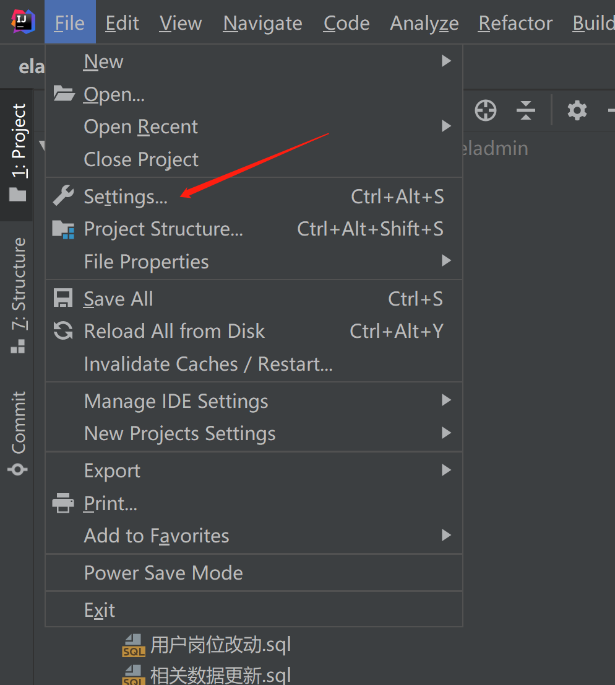
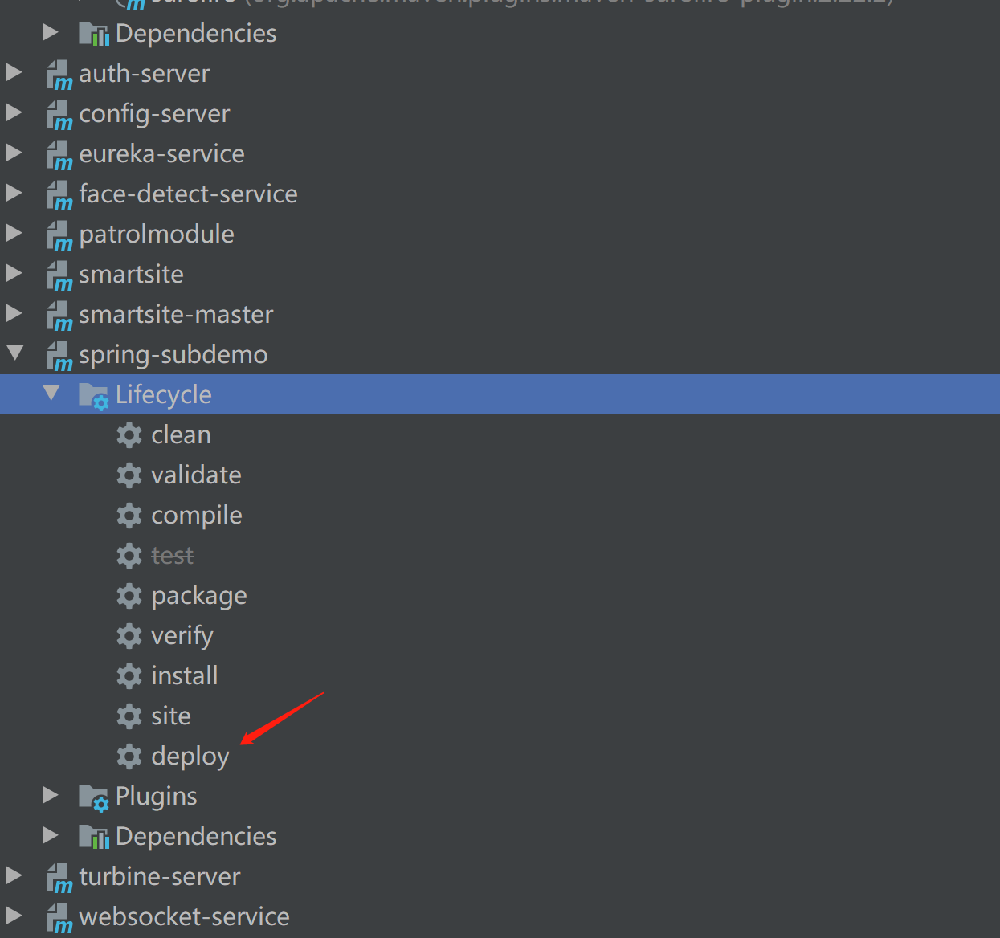

# 环境-Maven私服搭建及IDEA本地配置

[TOC]

## 0. 简介

Maven私服搭建即是搭建自己的本地Maven仓库，当 Maven 需要下载构件时，直接请求私服，私服上存在则下载到本地仓库；否则，私服请求外部的远程仓库，将构件下载到私服，再提供给本地仓库下载。其目的是代理远程仓库及部署第三方构件


市面上有成熟的软件来搭建私服，例如：[Apache Archiva](https://links.jianshu.com/go?to=http%3A%2F%2Farchiva.apache.org%2Findex.cgi)，[Artifactory](https://links.jianshu.com/go?to=http%3A%2F%2Fwww.jfrog.com%2Fhome%2Fv_artifactory_opensource_overview%2F)，[Sonatype Nexus](https://links.jianshu.com/go?to=http%3A%2F%2Fwww.sonatype.org%2Fnexus%2F)。本文实战部分使用**Sonatype Nexus**作为例子说明。

例子中使用的软件版本为：**nexus-3.26.1-02-win64**，服务器为**Windows Server 2012**.


## 1. 下载Sonatype Nexus

Sonatype Nexus Pro是需要付费的，我们可以使用开源版本Nexus OSS。下载地址为：https://www.sonatype.com/download-oss-sonatype


## 2. 安装及配置

（1）下载ZIP文件

在网站上找到最新的安装包zip文件，并下载。下载后，将压缩包解压到要部署私有仓库的服务器上任意地址。本例中就放在C盘根目录下。


（2）配置环境变量

配置环境变量的目的是为了更方便的启动和停止私有Maven仓库的服务。此步骤并不是必须的。如果不配置环境变量，可以之直接定位到Nexus解压目录下的bin目录下，执行相应命令。

首先，添加名为NEXUS_HOME的系统变量，路径为：C:\nexus-3.26.1-02-win64\nexus-3.26.1-02


然后，在系统变量的Path变量中添加bin文件夹的路径：%NEXUS_HOME%\bin\


（3）参数配置

在etc文件夹下，用文本编辑工具打开文件**nexus-default.properties**


其内容为：

```properties
## DO NOT EDIT - CUSTOMIZATIONS BELONG IN $data-dir/etc/nexus.properties
##
# Jetty section
application-port=8181
application-host=0.0.0.0
nexus-args=${jetty.etc}/jetty.xml,${jetty.etc}/jetty-http.xml,${jetty.etc}/jetty-requestlog.xml
nexus-context-path=/

# Nexus section
nexus-edition=nexus-pro-edition
nexus-features=\
 nexus-pro-feature

nexus.hazelcast.discovery.isEnabled=true
```

这里可以对一些基本的参数进行配置。例如：

```properties
#application-port=8081
application-port=8181
```

nexus运行默认使用的端口是8081，因为对于本工程而言，其于Nginx端口冲突，故将其改为8181。

```properties
#nexus-context-path=/nexus
nexus-context-path=/
```

nexus管理页面的url路径默认是"/"，故管理页面默认的访问路径是http://{ip地址:端口}/ 。如果将此参数设为nexus，则访问地址就变为http://{ip地址:端口}/ nexus

（4）执行命令，安装nexus服务，并启动

如果配置了环境变量，就可以直接用管理员方式运行cmd执行命令，如果没有配置环境变量，就需要定位到nexus目录中的bin文件夹下再执行命令。

执行

```shell
nexus.exe /install
```

可以为系统新建本地服务，如图：


这样就能直接在可视化界面中开启或者停止nexus服务。可以将该服务设置为自动启动：


执行：

```shell
nexus.exe /run
```

或者

```shell
nexus.exe /start
```

就能开启nexus服务了。


对于本例子而言，启动成功后就能通过http://localhost:8181/访问了。外网也可以通过外网IP和端口访问到该页面。如下图：


然后点击登录按钮，使用默认的用户名和密码登录。默认的用户名是admin，默认的密码保存在nexus解压后的路径中**sonatype-work**文件夹下,会有一个**admin.password**的文件，使用文本编辑工具打开，里面保存的就是默认密码。当使用过该密码登录后，会要求设置新的密码。新密码设置后，该**admin.password**文件会自动被删除。


## 3. IDEA配置及测试

IDEA中Maven默认使用Maven的中央仓库，故要使用私服仓库，需要进行配置。配置的方法是通过编写自定义的settings.xml文件，然后在IDEA中配置此文件路径即可。具体实现方式：

首先，进入Maven的默认安装目录下，定位到maven->lib->maven3->conf文件夹下，找到settings.xml文件，拷贝一份到maven默认的本地仓库文件夹C:\User\user_name\\.m2\目录下（当然也可以是别的路径），并将其改名为settings-custom.xml。

然后编辑文件，在<servers>和<mirrors>两个节点下添加内容，完整的文件如下：

```xml
<?xml version="1.0" encoding="UTF-8"?>

<!--
Licensed to the Apache Software Foundation (ASF) under one
or more contributor license agreements.  See the NOTICE file
distributed with this work for additional information
regarding copyright ownership.  The ASF licenses this file
to you under the Apache License, Version 2.0 (the
"License"); you may not use this file except in compliance
with the License.  You may obtain a copy of the License at

    http://www.apache.org/licenses/LICENSE-2.0

Unless required by applicable law or agreed to in writing,
software distributed under the License is distributed on an
"AS IS" BASIS, WITHOUT WARRANTIES OR CONDITIONS OF ANY
KIND, either express or implied.  See the License for the
specific language governing permissions and limitations
under the License.
-->

<!--
 | This is the configuration file for Maven. It can be specified at two levels:
 |
 |  1. User Level. This settings.xml file provides configuration for a single user,
 |                 and is normally provided in ${user.home}/.m2/settings.xml.
 |
 |                 NOTE: This location can be overridden with the CLI option:
 |
 |                 -s /path/to/user/settings.xml
 |
 |  2. Global Level. This settings.xml file provides configuration for all Maven
 |                 users on a machine (assuming they're all using the same Maven
 |                 installation). It's normally provided in
 |                 ${maven.conf}/settings.xml.
 |
 |                 NOTE: This location can be overridden with the CLI option:
 |
 |                 -gs /path/to/global/settings.xml
 |
 | The sections in this sample file are intended to give you a running start at
 | getting the most out of your Maven installation. Where appropriate, the default
 | values (values used when the setting is not specified) are provided.
 |
 |-->
<settings xmlns="http://maven.apache.org/SETTINGS/1.0.0"
          xmlns:xsi="http://www.w3.org/2001/XMLSchema-instance"
          xsi:schemaLocation="http://maven.apache.org/SETTINGS/1.0.0 http://maven.apache.org/xsd/settings-1.0.0.xsd">
  <!-- localRepository
   | The path to the local repository maven will use to store artifacts.
   |
   | Default: ${user.home}/.m2/repository
  <localRepository>/path/to/local/repo</localRepository>
  -->

  <!-- interactiveMode
   | This will determine whether maven prompts you when it needs input. If set to false,
   | maven will use a sensible default value, perhaps based on some other setting, for
   | the parameter in question.
   |
   | Default: true
  <interactiveMode>true</interactiveMode>
  -->

  <!-- offline
   | Determines whether maven should attempt to connect to the network when executing a build.
   | This will have an effect on artifact downloads, artifact deployment, and others.
   |
   | Default: false
  <offline>false</offline>
  -->

  <!-- pluginGroups
   | This is a list of additional group identifiers that will be searched when resolving plugins by their prefix, i.e.
   | when invoking a command line like "mvn prefix:goal". Maven will automatically add the group identifiers
   | "org.apache.maven.plugins" and "org.codehaus.mojo" if these are not already contained in the list.
   |-->
  <pluginGroups>
    <!-- pluginGroup
     | Specifies a further group identifier to use for plugin lookup.
    <pluginGroup>com.your.plugins</pluginGroup>
    -->
  </pluginGroups>

  <!-- proxies
   | This is a list of proxies which can be used on this machine to connect to the network.
   | Unless otherwise specified (by system property or command-line switch), the first proxy
   | specification in this list marked as active will be used.
   |-->
  <proxies>
    <!-- proxy
     | Specification for one proxy, to be used in connecting to the network.
     |
    <proxy>
      <id>optional</id>
      <active>true</active>
      <protocol>http</protocol>
      <username>proxyuser</username>
      <password>proxypass</password>
      <host>proxy.host.net</host>
      <port>80</port>
      <nonProxyHosts>local.net|some.host.com</nonProxyHosts>
    </proxy>
    -->
  </proxies>

  <!-- servers
   | This is a list of authentication profiles, keyed by the server-id used within the system.
   | Authentication profiles can be used whenever maven must make a connection to a remote server.
   |-->
  <servers>
    <server>
      <id>nexus-public</id>
      <username>admin</username>
      <password>admin123</password>
    </server>
	<server>
      <id>nexus-releases</id>
      <username>admin</username>
      <password>admin123</password>
    </server>
     <server>
      <id>nexus-snapshots</id>
      <username>admin</username>
      <password>admin123</password>
    </server>
    <!-- server
     | Specifies the authentication information to use when connecting to a particular server, identified by
     | a unique name within the system (referred to by the 'id' attribute below).
     |
     | NOTE: You should either specify username/password OR privateKey/passphrase, since these pairings are
     |       used together.
     |
    <server>
      <id>deploymentRepo</id>
      <username>repouser</username>
      <password>repopwd</password>
    </server>
    -->

    <!-- Another sample, using keys to authenticate.
    <server>
      <id>siteServer</id>
      <privateKey>/path/to/private/key</privateKey>
      <passphrase>optional; leave empty if not used.</passphrase>
    </server>
    -->
  </servers>

  <!-- mirrors
   | This is a list of mirrors to be used in downloading artifacts from remote repositories.
   |
   | It works like this: a POM may declare a repository to use in resolving certain artifacts.
   | However, this repository may have problems with heavy traffic at times, so people have mirrored
   | it to several places.
   |
   | That repository definition will have a unique id, so we can create a mirror reference for that
   | repository, to be used as an alternate download site. The mirror site will be the preferred
   | server for that repository.
   |-->
  <mirrors>
    <!-- mirror
     | Specifies a repository mirror site to use instead of a given repository. The repository that
     | this mirror serves has an ID that matches the mirrorOf element of this mirror. IDs are used
     | for inheritance and direct lookup purposes, and must be unique across the set of mirrors.
     |
    <mirror>
      <id>mirrorId</id>
      <mirrorOf>repositoryId</mirrorOf>
      <name>Human Readable Name for this Mirror.</name>
      <url>http://my.repository.com/repo/path</url>
    </mirror>
     -->
	 <mirror>
      <id>nexus-public</id>
      <mirrorOf>*</mirrorOf>
      <name>public-repo-mirror</name>
      <url>http://114.115.152.105:8181/repository/maven-public/</url>
    </mirror>
    <mirror>
      <id>nexus-releases</id>
      <mirrorOf>*</mirrorOf>
      <name>release-repo-mirror</name>
      <url>http://114.115.152.105:8181/repository/maven-releases/</url>
    </mirror>
     <mirror>
      <id>nexus-snapshots</id>
      <mirrorOf>*</mirrorOf>
      <name>snapshot-repo-mirror</name>
      <url>http://114.115.152.105:8181/repository/maven-snapshots/</url>
    </mirror>
  </mirrors>

  <!-- profiles
   | This is a list of profiles which can be activated in a variety of ways, and which can modify
   | the build process. Profiles provided in the settings.xml are intended to provide local machine-
   | specific paths and repository locations which allow the build to work in the local environment.
   |
   | For example, if you have an integration testing plugin - like cactus - that needs to know where
   | your Tomcat instance is installed, you can provide a variable here such that the variable is
   | dereferenced during the build process to configure the cactus plugin.
   |
   | As noted above, profiles can be activated in a variety of ways. One way - the activeProfiles
   | section of this document (settings.xml) - will be discussed later. Another way essentially
   | relies on the detection of a system property, either matching a particular value for the property,
   | or merely testing its existence. Profiles can also be activated by JDK version prefix, where a
   | value of '1.4' might activate a profile when the build is executed on a JDK version of '1.4.2_07'.
   | Finally, the list of active profiles can be specified directly from the command line.
   |
   | NOTE: For profiles defined in the settings.xml, you are restricted to specifying only artifact
   |       repositories, plugin repositories, and free-form properties to be used as configuration
   |       variables for plugins in the POM.
   |
   |-->
  <profiles>
    <!-- profile
     | Specifies a set of introductions to the build process, to be activated using one or more of the
     | mechanisms described above. For inheritance purposes, and to activate profiles via <activatedProfiles/>
     | or the command line, profiles have to have an ID that is unique.
     |
     | An encouraged best practice for profile identification is to use a consistent naming convention
     | for profiles, such as 'env-dev', 'env-test', 'env-production', 'user-jdcasey', 'user-brett', etc.
     | This will make it more intuitive to understand what the set of introduced profiles is attempting
     | to accomplish, particularly when you only have a list of profile id's for debug.
     |
     | This profile example uses the JDK version to trigger activation, and provides a JDK-specific repo.
    <profile>
      <id>jdk-1.4</id>

      <activation>
        <jdk>1.4</jdk>
      </activation>

      <repositories>
        <repository>
          <id>jdk14</id>
          <name>Repository for JDK 1.4 builds</name>
          <url>http://www.myhost.com/maven/jdk14</url>
          <layout>default</layout>
          <snapshotPolicy>always</snapshotPolicy>
        </repository>
      </repositories>
    </profile>
    -->

    <!--
     | Here is another profile, activated by the system property 'target-env' with a value of 'dev',
     | which provides a specific path to the Tomcat instance. To use this, your plugin configuration
     | might hypothetically look like:
     |
     | ...
     | <plugin>
     |   <groupId>org.myco.myplugins</groupId>
     |   <artifactId>myplugin</artifactId>
     |
     |   <configuration>
     |     <tomcatLocation>${tomcatPath}</tomcatLocation>
     |   </configuration>
     | </plugin>
     | ...
     |
     | NOTE: If you just wanted to inject this configuration whenever someone set 'target-env' to
     |       anything, you could just leave off the <value/> inside the activation-property.
     |
    <profile>
      <id>env-dev</id>

      <activation>
        <property>
          <name>target-env</name>
          <value>dev</value>
        </property>
      </activation>

      <properties>
        <tomcatPath>/path/to/tomcat/instance</tomcatPath>
      </properties>
    </profile>
    -->
  </profiles>

  <!-- activeProfiles
   | List of profiles that are active for all builds.
   |
  <activeProfiles>
    <activeProfile>alwaysActiveProfile</activeProfile>
    <activeProfile>anotherAlwaysActiveProfile</activeProfile>
  </activeProfiles>
  -->
</settings>

```

修改完后，保存文件。

然后，在idea中进行设置。进入File->Settings页面。



勾上图中override选框，并选择配置好的settings-custom.xml文件。


然后再项目的pom.xml文件中添加如下：（其中IP和端口对应的就是nexus所部属的IP和端口）

```xml

    <!--发布到私服配置-->
    <distributionManagement>
        <repository>
            <id>nexus-releases</id>
            <name>Internal Release</name>
            <url>http://xxx:xxx/repository/maven-releases/</url>
        </repository>
        <snapshotRepository>
            <id>nexus-snapshots</id>
            <name>Internal Snapshots</name>
            <url>http://xxx:xxx/repository/maven-snapshots/</url>
        </snapshotRepository>
    </distributionManagement>
```

其中的id要和settings-custom.xml中server节点中的id一一对应起来，否则会登录失败，提示401错误。

然后，Maven deploy。这里以spring-subdemo这个项目的snapshot版本为例：



如果成功，就能在私有仓库的maven-central中看到从maven中央仓库下载的一些包。在maven-snapshots中看到打包好的spring-subdemo这个项目的包。


